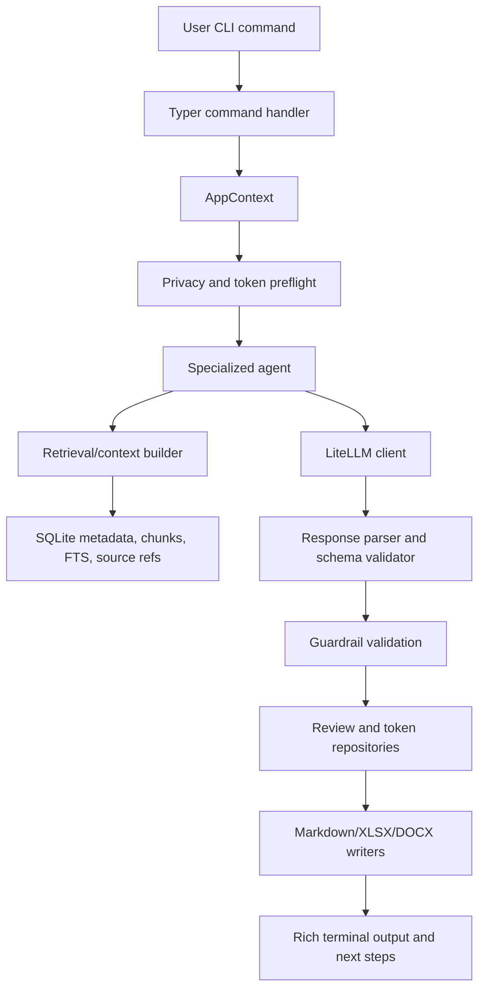

# SAKIPRO AI Agent Technical Design

Version: 1.0  
Date: 2026-05-27  
Status: Technical blueprint draft  
Prepared for: SAKIPRO implementation team  
Scope: AI agent architecture, orchestration, schemas, retrieval, privacy, guardrails, testing, and release criteria  

---

## 1. Executive Summary

SAKIPRO is a local-first Python CLI AI Agent for OPD SAKIP document review. The product reads a folder of SAKIP documents, indexes document content locally, retrieves relevant context, calls an external AI model through LiteLLM, validates structured AI output, and writes draft review reports without modifying original files.

The AI Agent design must satisfy five non-negotiable constraints from the blueprint:

1. All factual claims must be grounded in retrieved source references.
2. AI output is always draft and requires human validation for final use.
3. Original documents must never be changed.
4. API keys, prompts, PII, and sensitive OPD data must not leak to logs.
5. v0.2 must stay lightweight enough for a CPU-only office laptop.

The recommended v0.2 architecture is a deterministic pipeline with small specialized agents implemented as Python classes. Advanced orchestration frameworks such as LangGraph should remain optional for v0.2, after scan, retrieval, source references, privacy, schema validation, and golden tests are stable.

---

## 2. Blueprint Analysis Summary

### 2.1 Documents Reviewed

| Document | Role in AI Agent Design |
|---|---|
| `PRD.md` | Product goals, modes, agent list, journeys, requirements, data model, roadmap |
| `SAKIPRO.md` | Product identity, agent responsibilities, UX, output formats, security principles |
| `SCOPE.md` | Release scope control and v0.2/Post-v1.0 priority boundary |
| `SAKIP_RULEBOOK.md` | Testable review rules for indicator, PK, LKjIP, cascading, and evidence |
| `AI_CONTRACT.md` | Agent input/output schema, source reference contract, retry behavior |
| `PRIVACY.md` | Privacy pipeline, masking modes, sensitive data policy |
| `ERROR_HANDLING.md` | Error codes, retry policy, partial success behavior |
| `TEST_PLAN.md` | Golden dataset, mock AI strategy, required tests |
| `STACK.md` | Python, LiteLLM, SQLite, retrieval, document processing, packaging stack |
| `CLI_UX.md` | Command modes, slash commands, smart suggestions, token confirmations |
| `TREE.md` | Target module and file structure for implementation |
| `PACKAGING.md` | PyInstaller one-folder constraints and release verification |
| `RELEASE_CHECKLIST.md` | Pre-release, packaging, and manual QA gates |
| `AGENT_SKILLS.md` | Skill definitions, acceptance criteria, and version assignments |
| `TASK_MANAGEMENT.md` | Task decomposition, skill routing, and implementation patterns |

### 2.2 Scope Normalization

There is one important scope mismatch across documents:

| Area | Product Vision | `SCOPE.md` Release Control | Recommended Technical Treatment |
|---|---|---|---|
| `cek-indikator` | Core feature | v0.2 must have | Implement fully in v0.2 |
| `review-pk` | Core feature | v0.2 must have | Implement fully in v0.2 |
| `ask` / `chat` | Core interaction | `ask` must have, simple `chat` should have | Implement `ask`; keep `chat` thin wrapper |
| `review-lkjip` | Product review feature | v1.0 Expanded | Implement within v0.2 release gates |
| `cek-cascading` | Product review feature | v1.0 Expanded | Implement with graph-ready storage |
| `cek-evidence` | Product review feature | v1.0 Expanded | Implement after evidence linking is reliable |
| `report final` | Product target | v1.0 Expanded | Emit final Markdown/XLSX/DOCX draft with source appendix |
| Vector memory | - | Ditiadakan | SQLite FTS5 (BM25) eksklusif untuk efisiensi RAM/CPU |
| Workbench/task board | Product target | Post-v1.0 | Do not build into v0.2 core agent |

Decision: treat v0.2 as an implementation-ready release with Core and Expanded scope. Core covers ingestion, retrieval, ask, indicator review, PK review, privacy, token logging, source references, and per-command reports. Expanded adds LKjIP, cascading, evidence, recommendations, and final report.

---

## 3. AI Agent Goals and Non-Goals

### 3.1 Goals

| ID | Goal | Success Measure |
|---|---|---|
| AIG-001 | Ground all AI answers in local documents | Every answer/finding has `source_refs` |
| AIG-002 | Produce structured review findings | AI output validates against Pydantic schema |
| AIG-003 | Make SAKIP review explainable | Every finding maps to `SAKIP_RULEBOOK.md` rule ID |
| AIG-004 | Protect sensitive data | Privacy pipeline runs before every AI call |
| AIG-005 | Keep runtime laptop-friendly | No local GPU, no mandatory vector DB in v0.2 |
| AIG-006 | Support partial success | Failed files do not block successfully read files |
| AIG-007 | Control token cost | Token estimate, budget check, and usage logging exist |

### 3.2 Non-Goals for v0.2

1. Autonomous file modification.
2. Unsourced strategic recommendation.
3. Multi-user collaboration.
4. Direct integration with SIPD, e-SAKIP, SIMPEG, or external government systems.
5. Local LLM inference.
6. OCR as a required dependency.
7. Vector database (ChromaDB/FAISS) and embedding models (ditiadakan sepenuhnya).
8. Long-running multi-agent planner with complex state machine.

---

## 4. Architecture Overview

### 4.1 High-Level Flow



### 4.2 Core Runtime Layers

| Layer | Modules | Responsibility |
|---|---|---|
| CLI | `sakipro/cli/*` | Parse commands, invoke services/agents, render top-level UX |
| UI | `sakipro/ui/*` | Rich panels, tables, progress, errors, suggestions |
| App core | `sakipro/core/*` | Settings, paths, logging, exceptions, app context |
| Document engine | `sakipro/documents/*` | Scan, classify, extract, chunk, build source spans |
| Storage | `sakipro/storage/*` | SQLite models, repositories, transactions |
| Memory/retrieval | `sakipro/memory/*` | FTS5/BM25 search, context assembly, sliding token budgeting |
| AI infrastructure | `sakipro/ai/*` | LiteLLM client, model routing, prompts, schemas, token/cost, guardrails |
| Agents | `sakipro/agents/*` | Command-specific AI workflows |
| SAKIP domain | `sakipro/sakip/*` | Rulebook checks, consistency logic, recommendation helpers |
| Reports | `sakipro/reports/*` | Markdown, XLSX, DOCX, JSON outputs |

### 4.3 Agent Pattern

All agents should implement the same lifecycle:

1. Build task input from command options and workspace state.
2. Select rule IDs from `SAKIP_RULEBOOK.md`.
3. Retrieve candidate context chunks.
4. Run privacy pipeline on selected chunks.
5. Estimate token cost and request confirmation if needed.
6. Build prompt from prompt templates and validated context.
7. Call model through LiteLLM.
8. Parse JSON and validate with Pydantic.
9. Enforce source, confidence, draft, and rule guardrails.
10. Persist review result, token usage, warnings, and output paths.
11. Render Rich summary and suggested next steps.

---

## 5. Agent Inventory

### 5.1 Release Priority

| Agent | Module | v0.2 Status | Primary Command |
|---|---|---:|---|
| Task Agent (Orchestrator) | `agents/task_agent.py` | Must Have | `sakipro task`, `--plan` |
| Folder Scanner Agent | `agents/folder_scanner_agent.py` | Must have | `sakipro scan` |
| OPD Planning Copilot Agent | `agents/opd_planning_copilot_agent.py` | Must have for `ask`, thin for `chat` | `sakipro ask`, `sakipro chat` |
| Indicator Review Agent | `agents/indicator_review_agent.py` | Must have | `sakipro cek-indikator` |
| PK Review Agent | `agents/pk_review_agent.py` | Must have | `sakipro review-pk` |
| LKjIP Review Agent | `agents/lkjip_review_agent.py` | v1.0 Expanded | `sakipro review-lkjip` |
| Cascading Review Agent | `agents/cascading_review_agent.py` | v1.0 Expanded | `sakipro cek-cascading`, `sakipro cek-pohon` |
| Evidence Review Agent | `agents/evidence_review_agent.py` | v1.0 Expanded | `sakipro cek-evidence` |
| Draft Agent | `agents/draft_agent.py` | v1.0 Expanded | `sakipro draft` |
| Report Agent | `agents/report_agent.py` | v1.0 Core and Expanded | `sakipro report` |

### 5.2 BaseAgent Contract

```python
class BaseAgent(Protocol):
    agent_name: str
    supported_commands: list[str]
    default_model_tier: ModelTier

    def plan(self, request: AgentRequest, context: AppContext) -> AgentPlan: ...
    def gather_context(self, plan: AgentPlan, context: AppContext) -> RetrievalBundle: ...
    def run(self, request: AgentRequest, context: AppContext) -> AgentResult: ...
    def validate(self, result: AgentResult, context: AppContext) -> AgentResult: ...
```

Required implementation rules:

1. Agents must not read `.env` directly.
2. Agents must not write output files directly except through report writers.
3. Agents must not log raw prompt or raw sensitive chunk text.
4. Agents must return structured result objects only.
5. Agents must set `draft=true` on every AI result.

---

## 6. Detailed Agent Design

### 6.1 Folder Scanner Agent

Purpose: create the local knowledge base by scanning and indexing OPD documents.

Inputs:

| Field | Source |
|---|---|
| `folder_path` | CLI argument or wizard selection |
| `workspace_id` | active workspace |
| `privacy_mode` | config |
| `supported_extensions` | constants |

Processing:

1. Walk folder recursively.
2. Detect file extension and file metadata.
3. Compute file hash.
4. Classify document type using deterministic filename rules first.
5. Fall back to lightweight AI classification only when deterministic classification is uncertain and user permits token use.
6. Extract text/tables with the relevant reader.
7. Build chunks with location metadata.
8. Detect and classify sensitive content.
9. Store original chunk and/or masked chunk according to privacy mode rules.
10. Insert/update `documents`, `document_versions`, `document_chunks`, `source_refs`.
11. Refresh SQLite FTS index.
12. Generate scan summary report.

Outputs:

| Output | Format |
|---|---|
| Document registry | SQLite |
| Indexed chunks | SQLite FTS/BM25 |
| Scan summary | Markdown |
| File read warnings | Rich table and safe log |

Failure behavior:

1. Use `FILE_READ_FAILED` for unreadable files.
2. Use `FILE_PARTIAL_READ` when partial text/tables are available.
3. Continue processing other files.
4. Exit non-zero only if no file is successfully processed.

Acceptance criteria:

1. Source references include document ID, chunk ID, file path, document type, and location.
2. Failed files appear in scan summary.
3. No original file is modified.
4. No sensitive text is printed in terminal or log.

### 6.2 OPD Planning Copilot Agent

Purpose: answer user questions against indexed SAKIP documents and route natural language requests to commands.

Commands:

1. `sakipro ask "question"`
2. `sakipro chat`
3. Natural language command mapping such as `sakipro "review PK tahun 2026"`

Processing:

1. Classify intent as `qa`, `command_route`, `draft_request`, or `unsupported`.
2. For `qa`, retrieve context chunks by query.
3. Apply privacy pipeline.
4. Ask model to answer only from provided context.
5. Validate sources and confidence.
6. Render answer with source panel.

Prompt requirements:

1. Refuse to answer factual questions when sources are missing.
2. Say what document evidence is missing.
3. Do not invent numbers, targets, budgets, years, or document names.
4. Mark answer as draft.

v0.2 limitation: `chat` should be a thin loop over the same `ask` pipeline, not a separate memory-heavy agent.

### 6.3 Indicator Review Agent

Purpose: extract and evaluate performance indicators using `IND-001` to `IND-007`.

Rule coverage:

| Rule ID | Check |
|---|---|
| `IND-001` | Outcome orientation |
| `IND-002` | Definition clarity |
| `IND-003` | Formula availability |
| `IND-004` | Unit clarity |
| `IND-005` | Data source clarity |
| `IND-006` | Target consistency across IKU, Renstra, Renja, PK |
| `IND-007` | Baseline availability |

Processing:

1. Retrieve IKU, Renstra, Renja, PK, and relevant indicator tables.
2. Extract indicator candidates with deterministic table parsing where possible.
3. Normalize indicator names, units, year, target, and source document.
4. Group likely duplicate indicators by normalized name and semantic similarity rules.
5. Run deterministic checks for missing formula, unit, source data, baseline, and target.
6. Use AI for classification of indicator type and qualitative recommendation.
7. Validate each finding has rule ID and source reference.
8. Persist `indicators`, `reviews`, `review_findings`, and `review_sources`.
9. Generate Markdown and XLSX outputs.

Output fields:

| Field | Requirement |
|---|---|
| `indicator_name` | Required |
| `category` | `input`, `aktivitas`, `output`, `outcome`, `impact`, `tidak_jelas` |
| `quality_status` | `AMAN`, `PERLU CEK`, `PERLU REVISI`, `DATA KURANG` |
| `findings` | Must map to rule IDs |
| `source_refs` | Required |
| `confidence` | Required |

### 6.4 PK Review Agent

Purpose: compare Perjanjian Kinerja with IKU, Renstra, Renja, and supporting programs.

Rule coverage:

| Rule ID | Check |
|---|---|
| `PK-001` | PK objectives exist in planning documents |
| `PK-002` | Indicator names, units, and definitions are consistent |
| `PK-003` | Targets are consistent |
| `PK-004` | Programs/activities support objectives |
| `PK-005` | Responsible unit/official is clear |

Processing:

1. Locate PK document for selected year.
2. Retrieve related IKU, Renstra, Renja, RKA/DPA chunks.
3. Extract PK objectives, indicators, targets, units, and responsible parties.
4. Match PK indicators to planning document indicators.
5. Detect target and unit conflicts.
6. Use AI for reasoned explanation and recommendation, constrained by matched evidence.
7. Reject output if any high-severity finding has no source reference.
8. Generate Markdown and optional XLSX matrix.

Critical guardrail: the agent must never say a target is inconsistent unless both conflicting values have source references.

### 6.5 LKjIP Review Agent

Delivery phase: v0.2.

Purpose: evaluate LKjIP against PK, realization data, budget efficiency, LHE follow-up, and evidence.

Rule coverage:

1. `LKJ-001`: realization compared to PK target.
2. `LKJ-002`: success/failure analysis exists.
3. `LKJ-003`: budget efficiency analysis exists.
4. `LKJ-004`: LHE follow-up is recorded.
5. `LKJ-005`: evidence supports performance claims.

Technical dependency:

1. PK Review Agent must already create reliable PK indicator records.
2. Evidence linking should exist or LKjIP evidence checks must be marked `needs_human_validation=true`.
3. Budget extraction from RKA/DPA should be tested before strong efficiency claims.

### 6.6 Cascading Review Agent

Delivery phase: v0.2.

Purpose: evaluate logical relationships from objectives to indicators, programs, activities, subactivities, budget, and evidence.

Recommended technical design:

1. Extract nodes: `sasaran`, `indikator`, `program`, `kegiatan`, `subkegiatan`, `anggaran`, `evidence`.
2. Extract edges: `supports`, `measures`, `funds`, `evidences`.
3. Store relation candidates in SQLite first.
4. Use NetworkX only for graph analysis and tree rendering.
5. Detect disconnected chains, weak edges, duplicate objectives, and unsupported activities.

Graph output:

```json
{
  "nodes": [],
  "edges": [],
  "broken_chains": [],
  "source_refs": []
}
```

### 6.7 Evidence Review Agent

Delivery phase: v0.2.

Purpose: connect performance claims to supporting evidence files.

Processing:

1. Extract claims from PK/LKjIP/reports.
2. Index evidence files with file metadata, text, date, and document type.
3. Retrieve evidence candidates per claim.
4. Classify evidence relevance, verifiability, and sufficiency.
5. Produce evidence gap matrix.

Rules:

1. `EVD-001`: evidence relevant to claim.
2. `EVD-002`: evidence verifiable.
3. `EVD-003`: evidence sufficient.

Critical guardrail: never mark evidence as valid unless evidence source is readable and linked to a claim source.

### 6.8 Desk Evaluation Agent (Scoring & Predicate)

Delivery phase: v1.0 Expanded.

Purpose: simulate the evaluator's scoring based on the 4 components and estimate the SAKIP predicate.

Processing:

1. Aggregate findings from Indicator, PK, LKjIP, and Evidence agents.
2. Map findings to the 4 components (Planning, Measurement, Reporting, Internal Evaluation).
3. Compute component scores based on the weights defined in `SAKIP_RULEBOOK.md`.
4. Run reasoning model to determine if the organization is "Outcome-Oriented" vs "Administrative".
5. Generate a simulated LHE (Laporan Hasil Evaluasi) including strengths, weaknesses, and a predicted predicate (AA to D).

Output fields:

| Field | Requirement |
|---|---|
| `simulated_score` | float (0-100) |
| `predicted_predicate` | string (AA, A, BB, B, CC, C, D) |
| `component_breakdown` | JSON object |
| `strategic_recommendations` | list of strings |

---

## 7. Data and Schema Design

### 7.1 Core Entities

| Entity | Purpose | Key Relationships |
|---|---|---|
| `workspaces` | Active OPD workspace | owns documents, reviews, tasks |
| `documents` | File-level registry | has versions and chunks |
| `document_versions` | Hash-based version history | belongs to document |
| `document_chunks` | Extracted text/table chunks | belongs to document version |
| `source_refs` | Auditable source location | points to document and chunk |
| `indicators` | Extracted indicator facts | references source refs |
| `evidence_files` | Evidence registry | references workspace and source refs |
| `reviews` | Agent run result | has findings and sources |
| `review_findings` | Normalized findings | belongs to review |
| `review_sources` | Finding to source mapping | joins findings to source refs |
| `token_usage` | AI cost tracking | belongs to command/run |
| `run_history` | Command execution record | stores status and outputs |

### 7.2 Source Reference Contract

Every source reference must preserve traceability:

```json
{
  "source_id": "src_001",
  "document_id": "doc_001",
  "file_path": "Dokumen_SAKIP_OPD/PK_2026.docx",
  "document_type": "pk",
  "page": 3,
  "sheet": null,
  "cell_range": null,
  "paragraph_index": 18,
  "chunk_id": "chk_042",
  "quote": "short masked quote",
  "extraction_method": "docx_paragraph",
  "confidence": "high"
}
```

Rules:

1. `quote` must be short.
2. `quote` must use masked text when privacy mode is `standard`.
3. `source_id`, `document_id`, and `chunk_id` are required for AI-grounded claims.
4. XLSX references must include `sheet` and `cell_range` when available.
5. PDF references must include `page` when available.

### 7.3 Agent Input Schema

```json
{
  "workspace_id": "ws_001",
  "command": "review-pk",
  "privacy_mode": "standard",
  "task": "Review PK 2026",
  "rules": ["PK-001", "PK-002", "PK-003"],
  "context_chunks": [],
  "source_refs": [],
  "output_language": "id",
  "max_findings": 20
}
```

### 7.4 Agent Output Schema

```json
{
  "status": "success",
  "draft": true,
  "summary": "",
  "findings": [
    {
      "finding_id": "f_001",
      "rule_id": "PK-003",
      "severity": "high",
      "title": "",
      "description": "",
      "impact": "",
      "recommendation": "",
      "source_refs": ["src_001"],
      "confidence": "medium",
      "needs_human_validation": true
    }
  ],
  "recommendations": [],
  "sources": [],
  "token_usage": {},
  "warnings": []
}
```

Validation rules:

1. `draft` must be `true`.
2. `status` must be `success`, `partial_success`, or `failed`.
3. Each finding must have `rule_id`, `severity`, `confidence`, and `source_refs`.
4. `source_refs` must resolve to stored source records.
5. Low confidence findings must set `needs_human_validation=true`.
6. Output without sources must fail with `AI_SOURCE_REQUIRED`.

---

## 8. Retrieval and Context Strategy

### 8.1 v0.2/v1.0 Retrieval Strategy (SQLite FTS5 Exclusive)

Sistem secara eksklusif menggunakan pencarian berbasis indeks teks penuh **SQLite FTS5 (BM25)** dan deterministic keyword matching. Database vektor eksternal ditiadakan sepenuhnya untuk menjamin RAM laptop kantor tetap aman (0% memori tambahan).

Strategi Retrieval Terintegrasi:
1. **Deterministic Fetch:** Mengambil berkas secara presisi berdasarkan tipe dokumen (misalnya: memuat berkas `pk` dan `iku` saat perintah `review-pk`).
2. **SQLite FTS5 & BM25 Ranking:** Melakukan pencarian teks penuh terindeks dengan sistem pembobotan relevansi untuk mencocokkan nama indikator dan target.
3. **Sliding Context Budgeting:** Membatasi jumlah chunk yang digabungkan ke dalam *context window* secara dinamis:
   - **Light Tier (Fast):** Maksimal 15.000 token input.
   - **Default/Reasoning Tier:** Maksimal 60.000 token input.
4. **Context Deduplication:** Memastikan potongan data (chunks) yang identik disaring sehingga tidak dikirim berulang kali ke AI.

### 8.2 Memory-Safe Processing Rules

Untuk mendukung laptop kantor dengan RAM terbatas:
1. **Lazy Loading:** Jangan memuat seluruh isi dokumen ke memori saat registrasi metadata.
2. **Generator-based Extraction:** Pembaca dokumen (DOCX/XLSX/PDF) wajib mengembalikan generator chunk, bukan list raksasa.
3. **Batch Indexing:** Proses indexing dilakukan per 10-20 file untuk memberi kesempatan GC (Garbage Collection) membersihkan memori.
4. **SQLite Efficiency:** Gunakan transaksi yang tepat dan hindari query `SELECT *` pada tabel chunks yang besar.


### 8.2 Chunking Strategy

| Document Type | Chunk Unit | Required Metadata |
|---|---|---|
| DOCX | paragraph group or table row group | paragraph index, table index |
| PDF | page block | page number |
| XLSX | sheet row range or table region | sheet, cell range |
| CSV | row range | row numbers |
| TXT/MD | heading section or fixed token window | line range |

Recommended defaults:

1. Keep chunks around 800 to 1,500 tokens.
2. Keep table chunks structurally intact.
3. Add overlap only for narrative documents.
4. Always keep document type, year, file hash, and extraction method.

### 8.3 Context Builder

The context builder should produce:

```python
@dataclass
class RetrievalBundle:
    query: str
    chunks: list[ContextChunk]
    source_refs: list[SourceRef]
    warnings: list[str]
    estimated_tokens: int
```

Context selection rules:

1. Prefer direct document type matches for command-specific agents.
2. Prefer exact indicator/objective names when available.
3. Include both sides of a consistency comparison, such as PK target and IKU target.
4. Limit context by token budget.
5. If required documents are missing, return warning and lower confidence.

---

## 9. Privacy, Security, and Guardrails

### 9.1 Privacy Pipeline

Every AI-bound command must run:

```text
detect -> classify -> mask -> preview -> confirm -> send -> log_safe
```

Implementation ownership:

| Step | Module |
|---|---|
| `detect` | `ai/privacy_filter.py` |
| `classify` | `ai/privacy_filter.py`, `documents/metadata.py` |
| `mask` | `ai/privacy_filter.py` |
| `preview` | `ui/panels.py` |
| `confirm` | `ui/prompts.py` |
| `send` | `ai/llm_client.py` |
| `log_safe` | `core/logger.py` |

### 9.2 Privacy Modes

| Mode | AI Context Behavior | Storage Behavior |
|---|---|---|
| `open` | Send selected context as extracted | Store extracted chunks and source refs |
| `standard` | Mask PII/secrets before AI call | Store original only if local config permits; store masked text for AI cache |
| `strict` | Block sensitive chunks from cloud AI | Store metadata and safe source refs; agent may return `PRIVACY_BLOCKED` |

Default: `standard`.

### 9.3 Sensitive Patterns

Minimum detection:

1. NIK 16 digits.
2. Indonesian phone numbers.
3. Personal email.
4. Bank account number.
5. ASN/employee identifiers.
6. Home address.
7. Health, discipline, or personal evaluation data.
8. API keys, tokens, passwords, secrets.

### 9.4 AI Guardrails

The system prompt must enforce:

1. Answer only from provided context.
2. Do not invent numbers, targets, realization, budget, or file names.
3. Do not claim evidence exists unless evidence appears in source refs.
4. Use the relevant SAKIP rule IDs.
5. Return JSON only according to schema.
6. Mark output as draft.
7. Set `needs_human_validation=true` when confidence is low.

Post-model validation must enforce the same rules programmatically.

---

## 10. Model Routing and Token Control

### 10.1 Model Tiers & Supported Models

| Tier | Rekomendasi Model | Provider | Keunggulan |
|---|---|---|---|
| **Light** | `gemini-1.5-flash` | Google | Gratis (tier tertentu) & 1M context |
| | `gpt-4o-mini` | OpenAI | Sangat murah & stabil |
| **Default** | `gpt-4o` | OpenAI | Standar industri, sangat andal |
| | `claude-3-5-sonnet` | Anthropic | Coding & reasoning terbaik |
| | `claude-sonnet-4-20250514` | Anthropic | API Key Ready (Aktif di sistem) |
| **Reasoning** | `grok-beta` | xAI | Pengetahuan terkini |
| | `deepseek-chat` | DeepSeek | Performa tinggi, harga ekonomis |
| **Speed** | `llama-3.1-70b` | Groq | Respon instan (< 1 detik) |

### 10.2 Routing Policy

| Command | Default Tier | Notes |
|---|---|---|
| `scan` | none/light | AI classification only when deterministic classifier is uncertain |
| `ask` | default | light allowed for simple metadata questions |
| `cek-indikator` | default | reasoning only for full OPD review |
| `review-pk` | default | reasoning if many conflicts or cross-document comparisons |
| `review-lkjip` | reasoning | v0.2 |
| `cek-cascading` | reasoning | v0.2 when graph relations are complex |
| `cek-evidence` | default/reasoning | v0.2 |
| `task` | reasoning | Post-v1.0 |

### 10.3 Token Preflight

Before an AI call:

1. Estimate tokens from prompt, context, and response budget.
2. Compare with `max_tokens_per_task`.
3. If above `ask_confirmation_above_tokens`, render token confirmation.
4. Allow user to continue, switch to cheaper model, reduce context, or cancel.
5. Persist usage after call in `token_usage`.

---

## 11. Prompt Management

Prompt templates must live under:

```text
sakipro/templates/prompts/
```

Required templates:

| Template | Purpose |
|---|---|
| `system_base.md` | Shared guardrails and output contract |
| `folder_scan_prompt.md` | Optional ambiguous document classification |
| `indicator_review_prompt.md` | Indicator rule review |
| `pk_review_prompt.md` | PK consistency review |
| `lkjip_review_prompt.md` | v0.2 LKjIP review |
| `cascading_review_prompt.md` | v0.2 cascading review |
| `evidence_review_prompt.md` | v0.2 evidence review |
| `draft_recommendation_prompt.md` | Draft recommendations |
| `final_report_prompt.md` | v0.2 final report |
| `task_decomposition_prompt.md` | Post-v1.0 task mode |

Prompt assembly order:

1. `system_base.md`.
2. Command-specific role and task.
3. Rulebook excerpt for selected rule IDs.
4. JSON schema.
5. Retrieved context chunks and source refs.
6. Output constraints and max findings.

Prompt logging rule: do not log raw assembled prompts by default.

---

## 12. Error Handling and Retry

### 12.1 Error Codes Used by AI Agent Layer

| Code | Trigger | Agent Response |
|---|---|---|
| `CONFIG_MISSING` | workspace/config absent | tell user to run `sakipro init` |
| `API_KEY_MISSING` | provider key absent | stop before model call |
| `FILE_READ_FAILED` | reader cannot extract file | continue scan if other files succeed |
| `FILE_PARTIAL_READ` | partial extraction available | store partial result with warning |
| `PRIVACY_BLOCKED` | strict mode blocks required context | return failed or partial result |
| `TOKEN_LIMIT_EXCEEDED` | token estimate exceeds limit | ask user to reduce scope or confirm |
| `AI_SCHEMA_INVALID` | AI response fails schema | retry once with schema repair prompt |
| `AI_SOURCE_REQUIRED` | no source refs in output | fail command and suggest rescan/add documents |
| `OUTPUT_WRITE_FAILED` | report cannot be written | preserve review in DB and show output error |
| `DB_LOCKED` | SQLite lock | retry short operation or instruct user |

### 12.2 Retry Policy

1. File read: no automatic retry for corrupt/password-protected files.
2. AI call: up to two retries for transient provider/network failures.
3. JSON parse: one repair retry.
4. Output write: never overwrite old output; generate a new safe file name.

---

## 13. Report Output Design

### 13.1 v0.2 Required Outputs

| Command | Markdown | XLSX | DOCX |
|---|---:|---:|---:|
| `scan` | required | optional | no |
| `ask` | no | no | no |
| `cek-indikator` | required | required | optional |
| `review-pk` | required | required | optional |
| `token` | no | no | no |

### 13.2 Report Requirements

Each AI-generated report must include:

1. Draft label.
2. Command and timestamp.
3. Workspace and folder summary.
4. Privacy mode used.
5. Model/provider used.
6. Findings table.
7. Rule IDs.
8. Severity and confidence.
9. Source reference appendix.
10. Warnings and human validation notes.

Filename convention:

```text
YYYYMMDD_HHMM_<jenis_laporan>_<opd>.<ext>
```

---

## 14. Observability and Audit

### 14.1 Logs

| Log | Content | Must Not Contain |
|---|---|---|
| `sakipro.log` | command start/end, status, safe paths | API keys, raw prompt, PII |
| `errors.log` | error codes, stack traces in dev mode | document contents, secrets |
| `agent_runs.log` | agent name, model, status, token count | raw prompt/context |
| `token_usage.log` | token and cost summary | prompt text |

### 14.2 Run History

Every command should write `run_history`:

1. `workspace_id`
2. `command`
3. `status`
4. `started_at`
5. `finished_at`
6. `error_code`
7. `output_paths_json`

### 14.3 Audit Events

Required audit events:

1. Workspace initialized.
2. Folder scanned.
3. Sensitive data detected.
4. Context blocked by strict privacy mode.
5. AI call sent.
6. AI schema retry performed.
7. Review result saved.
8. Report file written.
9. Token threshold confirmation accepted or canceled.

---

## 15. Implementation Roadmap

### 15.1 v0.2 AI Agent Roadmap

| Phase | Deliverables | Exit Criteria |
|---|---|---|
| 1. Foundation | `AppContext`, settings, logger, error classes, Typer skeleton | `sakipro --help`, `init`, `doctor` work |
| 2. Document engine | readers, classifier, chunker, source refs | golden scan fixture passes |
| 3. Storage/retrieval | SQLite models, repositories, FTS/BM25, context builder | `ask` can retrieve cited chunks |
| 4. AI infrastructure | LiteLLM client, model router, prompt manager, schemas, parser, token manager | mock AI contract tests pass |
| 5. Privacy/guardrails | privacy filter, masking, strict block, source validation | security tests pass |
| 6. v0.2 agents | Scanner, Copilot, Indicator, PK | indicator and PK golden outputs pass |
| 7. Reports | Markdown/XLSX writers, source appendix | outputs generated without altering fixtures |
| 8. Packaging readiness | PyInstaller smoke test and release checks | release checklist passes |

### 15.2 v1.0 Expanded AI Agent Roadmap

1. LKjIP Review Agent.
2. Cascading Review Agent.
3. Evidence Review Agent.
4. NetworkX graph analysis.
5. Dynamic sliding context budget validation.
6. Final report generator.
7. DOCX templates.

### 15.3 Post-v1.0 AI Agent Roadmap

1. Task Agent and resumable task state.
2. Workbench mode.
3. Task board.
4. Graph visualization.
5. Batch or multi-year review support.

---

## 16. Testing Strategy

### 16.1 Test Types

| Test Type | Focus |
|---|---|
| Unit | schemas, parser, privacy filter, token manager, model router, rule checkers |
| Integration | CLI commands, scan, retrieval, ask, indicator review, PK review |
| Contract | AI input/output JSON, source refs, report payload |
| Security | secret leakage, masking, strict privacy block |
| Golden dataset | deterministic expected scan/review outputs |
| Packaging smoke | executable `--help`, `doctor`, `scan` |

### 16.2 Requirement-to-Test Traceability

| Requirement | Test ID | Scenario | Expected Result |
|---|---|---|---|
| AIG-001 | `TC-AI-001` | AI output has no source refs | Parser rejects with `AI_SOURCE_REQUIRED` |
| AIG-002 | `TC-AI-002` | AI returns malformed JSON | One schema repair retry occurs |
| AIG-003 | `TC-AI-003` | Finding has unknown rule ID | Guardrail rejects finding |
| AIG-004 | `TC-SEC-001` | Context contains NIK/API key | Sensitive value is masked before AI call |
| AIG-005 | `TC-PERF-001` | Scan 100 medium files | Completes under target or reports partial success |
| AIG-006 | `TC-SCAN-001` | One PDF unreadable, DOCX readable | Scan succeeds with warning |
| AIG-007 | `TC-TOKEN-001` | Estimated token exceeds threshold | User confirmation is requested |
| IND rules | `TC-IND-001..007` | Positive and negative fixtures per indicator rule | Findings match expected rule IDs |
| PK rules | `TC-PK-001..005` | PK consistency fixtures | Conflicts require both source refs |

### 16.3 Mock AI Policy

Automated tests must not call live AI providers. Use fixture responses:

1. Valid JSON with sources.
2. Invalid JSON then repaired JSON.
3. JSON with missing sources.
4. Low confidence finding.
5. Privacy-blocked context.

---

## 17. Acceptance Criteria for AI Agent Layer

v0.2 AI Agent layer is complete when:

1. `sakipro scan` indexes supported document types and handles partial failures.
2. `sakipro ask` answers with source references or refuses when sources are missing.
3. `sakipro cek-indikator` produces Markdown and XLSX review outputs.
4. `sakipro review-pk` produces sourced PK findings.
5. Every AI output validates against Pydantic schemas.
6. Every finding has a rule ID, severity, confidence, and source refs.
7. Low confidence findings require human validation.
8. Privacy mode `standard` masks sensitive values before AI calls.
9. Privacy mode `strict` blocks sensitive chunks.
10. API keys and PII do not appear in logs.
11. Token usage is persisted and visible through `sakipro token`.
12. Original fixture files remain unchanged after all commands.
13. Golden dataset tests pass without live AI calls.
14. PyInstaller one-folder smoke tests pass for `--help`, `doctor`, and `scan`.

---

## 18. Key Risks and Mitigations

| Risk | Impact | Likelihood | Mitigation |
|---|---|---:|---|
| AI hallucination | Wrong SAKIP recommendation | High | Source-required output, rulebook IDs, schema validation |
| Poor document extraction | Missing or wrong findings | Medium | partial success, source spans, manual validation warnings |
| Sensitive data leakage | Security/privacy incident | Medium | privacy pipeline, safe logging, strict mode |
| Token cost overrun | User distrust or budget issue | Medium | model routing, token preflight, confirmation |
| Scope creep into v0.2 features | v0.2 delayed | High | enforce `SCOPE.md` release boundary |
| Packaging dependency issues | Windows release failure | Medium | PyInstaller one-folder, smoke tests, optional extras |
| Inconsistent blueprint priorities | Implementation confusion | Medium | this design treats `SCOPE.md` as release authority |

---

## 19. Open Decisions

| ID | Decision Needed | Recommended Default |
|---|---|---|
| OD-001 | Whether original unmasked chunks may be stored locally in `standard` mode | Store locally only in SQLite, never in AI cache/logs |
| OD-002 | Whether AI classification is allowed during `scan` by default | No, only when deterministic classifier is uncertain and user confirms |
| OD-003 | Which provider/model names become default in `config.example.yaml` | Keep generic placeholders until provider decision |
| OD-004 | Whether `review-lkjip` is exposed as hidden experimental command in v0.2 | Do not expose in stable v0.2 |
| OD-005 | Whether DOCX output is required for v0.2 | Optional; Markdown/XLSX are release-critical |

---

## 20. Recommended Implementation Skeleton

```text
sakipro/
  ai/
    schemas.py
    llm_client.py
    model_router.py
    prompt_manager.py
    token_manager.py
    privacy_filter.py
    guardrails.py
    response_parser.py
  agents/
    base_agent.py
    folder_scanner_agent.py
    opd_planning_copilot_agent.py
    indicator_review_agent.py
    pk_review_agent.py
    lkjip_review_agent.py
    cascading_review_agent.py
    evidence_review_agent.py
  memory/
    indexer.py
    search.py
    retrieval.py
    context_builder.py
  sakip/
    indicator_checker.py
    pk_checker.py
    consistency_checker.py
    recommendation_builder.py
    quality_gate.py
```

Implementation priority should follow the roadmap in section 15, with tests written alongside each layer.

## 21. Advanced Agentic Features (Inspired by Gemini CLI)

### 21.1 Execution Plan Mode

Setiap command audit kompleks (misal: `review-all`) wajib mendukung flag `--plan`:
1. **Decomposition:** Memecah tugas menjadi urutan langkah teknis.
2. **Resource Mapping:** Mengidentifikasi file mana yang akan dibaca oleh agen mana.
3. **Cost Preflight:** Menghitung estimasi token berdasarkan jumlah chunk.
4. **Approval Gate:** Menunggu konfirmasi user sebelum eksekusi dimulai.

### 21.2 Sub-Agent Delegation

Arsitektur harus mendukung pola `Orchestrator -> Worker`:
- **Orchestrator:** Menerima input user dan memilih agen spesialis.
- **Workers:** Agen atomik seperti `IndicatorReviewAgent`, `ConsistencyAgent`, dll.
- **Benefits:** Pemisahan *system prompt* yang bersih (separation of concerns).

### 21.3 Workspace Memory (MEMORY.md)

Sistem harus memelihara memori proyek jangka panjang:
- **Location:** `.sakipro/MEMORY.md`.
- **Content:** Fakta organisasi (Visi, Misi, Struktur OPD) yang diekstrak saat `scan`.
- **Usage:** Disuntikkan ke dalam *working memory* AI pada setiap sesi untuk menjaga relevansi konteks tanpa scan ulang file mentah.

### 21.4 Surgical Drafting (Text Replacement)

Agen harus mampu mengusulkan revisi teks secara presisi:
- **Input:** Teks asli yang bermasalah.
- **Output:** Teks usulan revisi.
- **Mechanism:** User menyetujui revisi via `Decision Gate` di CLI, dan SAKIPRO mencatatnya ke draf laporan perbaikan.

---

## 22. Final Technical Position

SAKIPRO should not be implemented as a free-form autonomous agent in v0.2. The safer and more release-ready design is a governed RAG pipeline with specialized agents, deterministic pre-checks, strict output schemas, source reference enforcement, privacy filtering, and report writers.

This approach aligns with the product goal of helping OPD planning staff quickly review SAKIP documents while keeping every AI-generated claim auditable, draft-only, and safe for a local office-laptop workflow.
